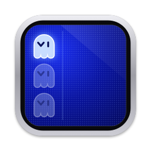
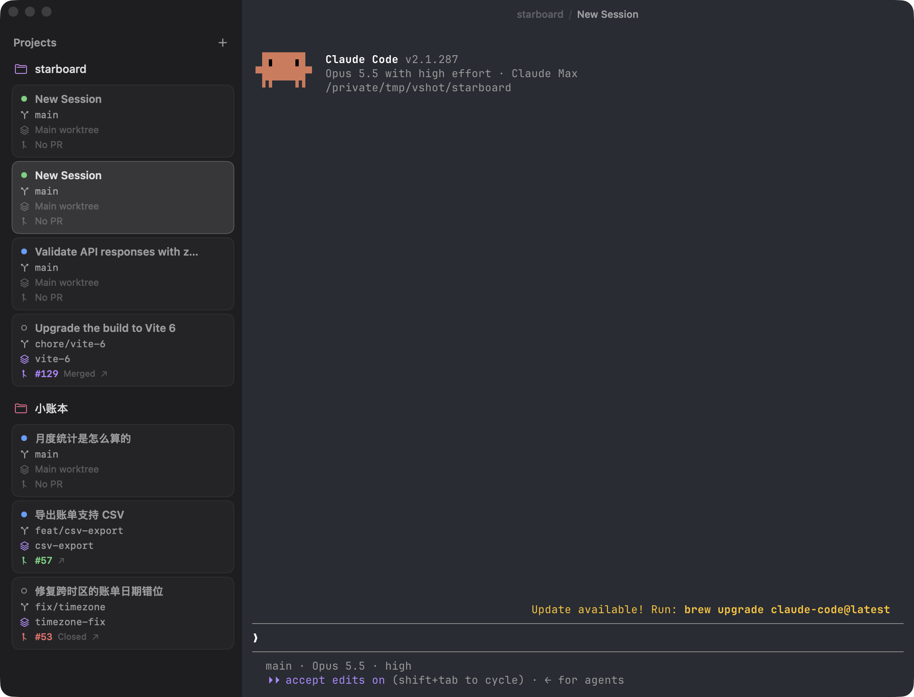

<p align="center"></p>

<h1 align="center">Vhostty</h1>

<p align="center"><b>A vertical-tab terminal built for Claude Code and Codex</b></p>

<p align="center">English · <a href="README.zh-CN.md">简体中文</a></p>

Vhostty is a native macOS terminal for running several Claude Code and Codex sessions at once. Each session is a card in the left sidebar, and the card shows the agent's state (working / waiting for permission / waiting for input / done), the current branch, the worktree and the PR, so you don't have to switch to each one to check on it.

The terminal engine is [Ghostty](https://ghostty.org) (libghostty), and it uses your existing Ghostty config. The app shell is written in SwiftUI/AppKit, with no web technology involved.

> Vhostty = **V**ertical + G**hostty**: Ghostty's tabs, turned on their side and moved into a sidebar.

<p align="center"></p>

The interface follows your system language (English or Simplified Chinese).

## Features

- **Projects on the left**: each project is bound to a directory.
- **Session cards under each project**: each session is one Claude Code or Codex terminal. A card has 4 lines:
  1. The session title, with a status icon and a Claude or Codex icon in front. Claude's title comes from its auto-generated title or `/rename`, Codex's from its thread title
  2. The current branch
  3. The worktree name, or 「主工作区」 (main worktree) when not in a worktree
  4. The PR number, e.g. `#123`, colored by state: open green / merged purple / closed red. Click it to open the PR in your browser
- **New session**: `cd`s into the project directory and starts `claude` or `codex`. A project's ⋯ menu has both; "Set Default Session" picks, per project, which one ⌘T and the ✎ button start. When the agent exits, the terminal stays in your shell. A new Codex session is matched to its card once you send its first message. Inside Vhostty, Codex's terminal title is set by Vhostty (it reads the session id from there), so your `tui.terminal_title` setting doesn't apply in its cards.
- **Live status**:
  - Spinner = the agent is working
  - ✋ = waiting for you to approve a permission (Claude only)
  - Green dot = waiting for your input
  - Blue dot = finished in the background and you haven't looked yet
  - Hollow circle = not started
- **Background notifications**: these are the agent's own terminal notifications (Claude Code and Codex both send OSC 9 in Ghostty), so your notification settings in Claude or Codex are respected. When the session isn't selected or the window is in the background, Vhostty turns them into macOS system notifications; clicking one jumps to that session. Claude usually only notifies after finishing and waiting about 60 seconds for you, but the blue dot on the card and the Dock badge update immediately (via Claude Code hooks, or Codex's terminal title).
- **Session history**: each project lists its recent Claude and Codex sessions; click one to resume it with `claude --resume` or `codex resume`.
- **Autosave**: all session cards are saved on quit. On next launch a session is only restored when you click its card, so you don't get a pile of agents starting at once.
- **Bottom shell**: every session can pull up a plain shell below the agent (⌘J or ⌃`), in the same directory the agent is currently in. The divider between the two is draggable, and whether the panel is open is saved with the session.
- **Reuses your Ghostty config**: reads your Ghostty config (fonts, theme, keybindings) from `~/.config/ghostty/config` or `~/Library/Application Support/com.mitchellh.ghostty/config`.

## Keyboard shortcuts

| Shortcut | Action |
|---|---|
| ⌘T | New session in the current project (of that project's default kind) |
| ⇧⌘O | Add project |
| ⌘W | Close the current session (asks first if the agent is still running) |
| ⌘1…9 | Switch to the Nth session |
| ⇧⌘[ / ⇧⌘] | Previous / next session |
| ⌃⌘S | Show/hide the sidebar |
| ⌘J / ⌃` | Show/hide the bottom shell |
| ⌥⌘↑ / ⌥⌘↓ | Focus Agent / focus the bottom shell |
| ⌘+ / ⌘- / ⌘0 | Increase / decrease / reset font size |

Right-click a session card or a project for more actions. Session cards can also be dragged to reorder.

## Installing

Apple Silicon Macs, macOS 14 or later:

```bash
curl -fsSL https://raw.githubusercontent.com/SunRunAway/vhostty/master/scripts/install.sh | bash
```

This downloads the latest build from [Releases](https://github.com/SunRunAway/vhostty/releases) into `/Applications`. Run it again to update.

The app isn't notarized by Apple. If you download the zip from the Releases page in a browser instead, macOS will refuse to open it. Allow it under System Settings → Privacy & Security → "Open Anyway", or run `xattr -dr com.apple.quarantine /Applications/Vhostty.app`.

## Building

To build from source instead:

You only need the Command Line Tools and zig; **Xcode is not required**.

```bash
brew install zig          # needs 0.15.2 (required by Ghostty 1.3.1)
git clone --recursive https://github.com/SunRunAway/vhostty.git
cd vhostty
make                      # the first build compiles libghostty, about 5 minutes
make install              # copies to /Applications/Vhostty.app
```

## Development

How it works, how the build avoids Xcode, and how to debug are covered in [DEVELOPER.md](DEVELOPER.md) (in Chinese).
